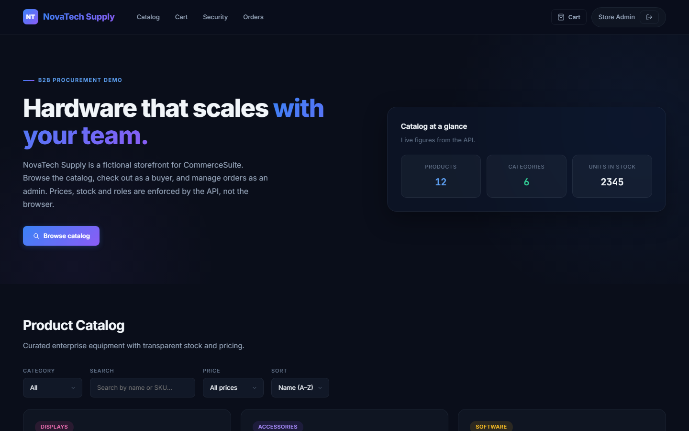
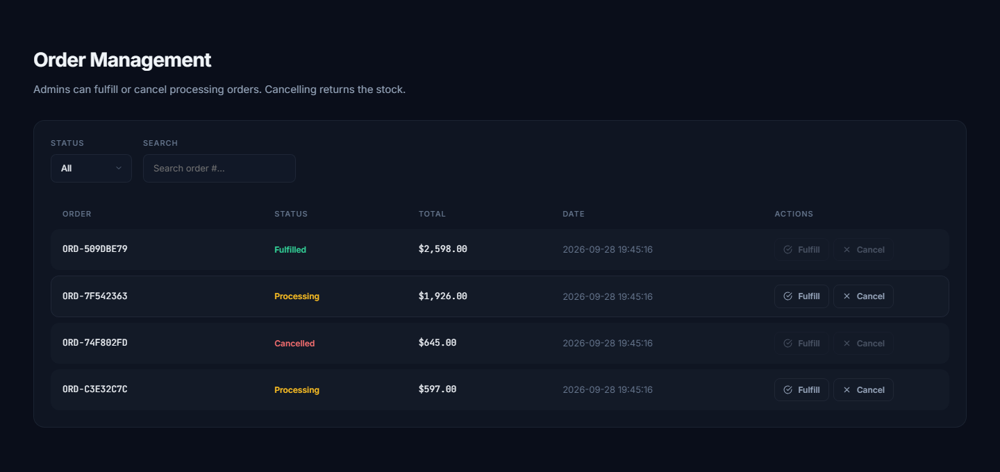

# CommerceSuite

[](https://github.com/JimmyAlter/CommerceSuite/actions/workflows/ci.yml)

A B2B procurement storefront: catalog, cart and checkout for buyers, and order management for admins. Totals, stock and roles are enforced by the API, not the browser. The UI is branded as "NovaTech Supply", a fictional company used only as the in-app demo brand.

**Live demo:** [commercesuite-demo.vercel.app](https://commercesuite-demo.vercel.app). The API runs on Render's free tier, so the first request after a while idle can take up to a minute.

| Role | Email | Password |
|---|---|---|
| Admin | `admin@commercesuite.dev` | `demo123` |
| Buyer | `buyer@commercesuite.dev` | `demo123` |

The demo database is recreated and seeded every time the API restarts (deploys, cold starts), so orders placed there do not persist.





## What it does

- **Catalog**: public list of active products, with category, search, price filters and sorting in the UI. Inactive products cannot be ordered, even by id
- **Checkout**: the client sends product IDs and quantities only. The server reads prices from the database, checks stock, and writes the order, its line items and the stock decrement in one SQLite transaction. If any line fails, nothing is written
- **My orders**: a signed-in buyer sees their own orders and line items. Admins see every order with its buyer and line items
- **Roles**: `requireRole('admin')` guards product creation, the full order list and status changes, so a buyer token gets a 403. The role is read from the database on every request, so demoting or deleting a user takes effect immediately. Hiding admin screens in the UI is not what protects them
- **Order status**: `processing` can move to `fulfilled` or `cancelled`, and both are final. Any other transition is a 409. Cancelling puts the reserved stock back in the same transaction

## Architecture

```text
React 19 + Vite (Vercel) ──HTTPS/JSON──► Express 4 API (Render) ──► SQLite (better-sqlite3)
```

| Path | What lives there |
|---|---|
| `backend/src/server.js` | Routes, auth middleware, validation, error handlers |
| `backend/src/config.js` | CORS origin and `trust proxy` parsing |
| `backend/src/db.js` | Schema (foreign keys, CHECK constraints) and seed data |
| `frontend/src/api.js` | `fetchJson` helper: base URL, headers, `{ error }` handling |
| `frontend/src/format.js`, `session.js` | Date/currency formatting, guarded `localStorage` access |
| `frontend/src/App.jsx` | App state and API calls |
| `frontend/src/components/` | Page sections (catalog, cart, orders, …) and the sign-in and checkout modals |

## API

Request and response bodies are JSON. Errors are always `{ "error": "message" }`. Authenticated routes take `Authorization: Bearer <token>`.

| Method | Path | Auth | Notes |
|---|---|---|---|
| GET | `/api/health` | none | `{ "status": "ok" }` |
| POST | `/api/auth/login` | none | `{ email, password }` returns `{ token, user }`. Email is case-insensitive. Rate limited to 20/min per client |
| GET | `/api/products` | none | Active products |
| POST | `/api/products` | admin | Create a product |
| POST | `/api/orders` | any user | `{ items: [{ product_id, quantity }], shipping: { name, address, city, country }, payment_method? }` |
| GET | `/api/orders/mine` | any user | The caller's orders, each with its `items` |
| GET | `/api/orders` | admin | All orders, each with `buyer_name` and `items` |
| PATCH | `/api/orders/:id` | admin | `{ status }`, `fulfilled` or `cancelled`; returns the updated order in the same shape |

## Validation and errors

| Case | Response |
|---|---|
| Malformed JSON body, missing or wrong-typed fields (login, orders, products) | 400 |
| Unknown product, bad quantity (not a whole number from 1 to 999), more than 50 lines, missing shipping fields, unknown payment method | 400 |
| Missing, malformed, expired or wrongly signed token, a scheme other than `Bearer`, or a token for a deleted user | 401 |
| Buyer (or demoted admin) calling an admin route | 403 |
| Request from a browser origin that is not allowed | 403 |
| Unknown route, status change on a missing order | 404 |
| Not enough stock, inactive product, duplicate SKU, status change that is not allowed | 409 |
| Body over 200 KB | 413 |
| More than 20 login attempts in a minute from one client | 429 |
| Anything unexpected | 500 with a generic message; details are only logged server-side |

## Running it locally

Requires Node.js 22 or newer.

```bash
cd backend
cp .env.example .env
npm ci
npm start            # http://localhost:4100, creates and seeds the database on first run

cd ../frontend
npm ci
npm run dev          # http://localhost:5173, talks to http://localhost:4100 by default
```

Backend environment variables (see `backend/.env.example`):

| Variable | Default | Purpose |
|---|---|---|
| `PORT` | `4100` | HTTP port |
| `JWT_SECRET` | dev value | Required in production; the server exits if it is missing or still the dev default |
| `CORS_ORIGIN` | none | Comma-separated browser origins allowed to call the API. `http://localhost` and `http://127.0.0.1` (any port) are also allowed when `NODE_ENV` is not `production` |
| `DB_PATH` | `backend/data/commercesuite.db` | SQLite file |
| `TRUST_PROXY` | `1` in production, off otherwise | Express `trust proxy` value (hop count, `true`/`false`, or a subnet list), so the rate limit sees the real client IP behind a reverse proxy |

The frontend reads `VITE_API_URL` (default `http://localhost:4100`).

## Tests and CI

```bash
cd backend && npm test          # or: npm run test:coverage
cd frontend && npm test && npm run lint
cd frontend && npx playwright install chromium && npm run test:e2e   # browser smoke tests
```

The backend node:test suite starts the API against a throwaway SQLite file and covers:

- RBAC on every admin route, roles re-read on each request (a demoted or deleted user loses access), and buyers only seeing their own orders
- totals computed from server prices, even when the client sends a price
- an order that exceeds stock is rejected and leaves orders and inventory untouched
- the order status rules, including stock being restored once on cancel
- every row of the validation table above, including expired, `alg: none` and non-Bearer tokens
- CORS and `trust proxy` configuration
- the schema: seeding an empty database, foreign keys, CHECK constraints, and booting on a database created with the older schema

The frontend has vitest tests for the `fetchJson` helper (headers are merged so `Content-Type` survives an `Authorization` header, and server error messages reach the UI), for SQLite UTC timestamps being shown in local time, and for a corrupt or blocked `localStorage` leaving the user signed out instead of crashing the page.

The Playwright smoke tests (`frontend/e2e/`) start the real API on a throwaway SQLite file and the Vite dev server, then check in Chromium that a buyer can sign in with the demo button, check out and see the order in My Orders; that an admin can cancel a processing order and its stock returns to the catalog; and that the first screen at 375px has no horizontal overflow.

CI runs the backend suite with coverage on Node 22 and 24, the frontend lint, tests and build, and the Playwright smoke tests (traces are uploaded when they fail). Dependabot opens weekly grouped minor/patch updates for both packages and the workflow actions; majors that need a deliberate migration (Express 5, ESLint 10, dotenv) are ignored.

## Security notes

- All queries are prepared statements with `?` placeholders.
- Passwords are bcrypt hashes and are never returned. Login for an unknown email still runs a bcrypt comparison against a dummy hash, so it takes about as long as a wrong password.
- JWTs are signed and verified with HS256 only and expire after 8 hours. The token only identifies the user; name and role come from the database on each request.
- `helmet` sets the default security headers. JSON bodies are capped at 200 KB. Login is limited to 20 attempts per minute per client IP; `trust proxy` makes that work behind Render's proxy.
- With `NODE_ENV=production`, the server exits at startup if `JWT_SECRET` is missing or still the development default, and localhost origins are rejected.
- The frontend keeps the token in `localStorage`. That keeps the demo simple, but any XSS on the page could read it. A production build would use an `HttpOnly`, `SameSite` cookie with CSRF protection instead.

See [SECURITY.md](SECURITY.md) to report a vulnerability.

## Deployment

`render.yaml` defines the API service: `npm ci`, a health check, a generated `JWT_SECRET` and `CORS_ORIGIN` for the Vercel site. Render's free plan has no persistent disk, so SQLite lives on the instance's ephemeral filesystem and is seeded on boot. The frontend is a static Vite build on Vercel with `VITE_API_URL` pointing at the API.

## Limitations

- SQLite on a single instance. Running more than one instance, or keeping data across restarts, means moving to PostgreSQL; the data layer is in `backend/src/db.js`.
- Foreign keys and CHECK constraints apply to databases created with the current schema. An older database file still works but keeps its old tables until it is recreated. There is no migration tool.
- No real payments, taxes or shipping. `payment_method` is recorded; nothing is charged.
- No product editing, order pagination or password reset. Product creation is API-only; the UI has no form for it.
- The token lives in `localStorage` (see Security notes).

It shares its foundation with [AssetDesk](https://github.com/JimmyAlter/AssetDesk), an IT operations workspace by the same author.

## License

MIT. See [LICENSE](LICENSE).
